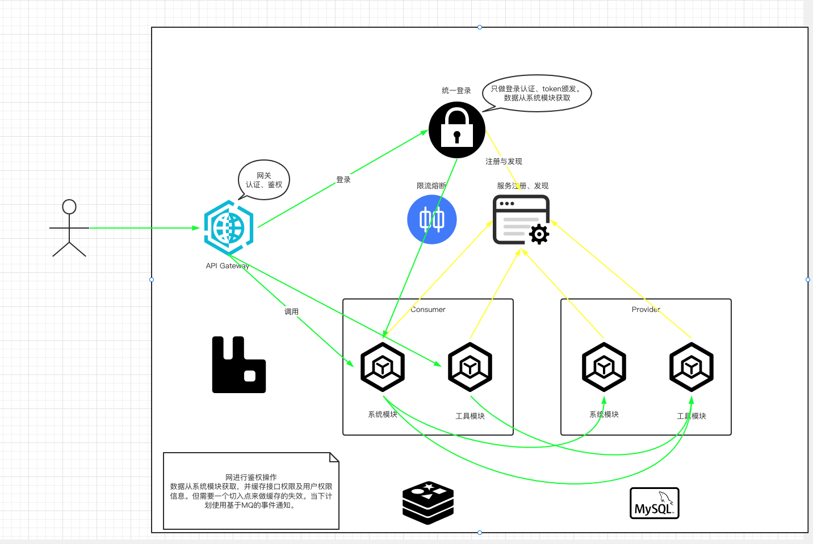

<h1 style="text-align: center">EL-ADMIN 后台管理系统</h1>
<div style="text-align: center">

[](https://github.com/lWoHvYe/eladmin/blob/main/LICENSE)
[](https://github.com/lWoHvYe/eladmin)
[](https://github.com/lWoHvYe/eladmin)

</div>

本项目在原eladmin项目的基础上，进行了部分扩展及尝试，在此表示感谢。

---
启动类 [AppRun.java](eladmin-starter/src/main/java/com/lwohvye/AppRun.java) 和配置文件 [resources](eladmin-starter/src/main/resources)
详见 [eladmin-starter](eladmin-starter) 模块。[启停脚本](script)

**Java16**之后，默认强封装JDK内部类，详见[JEP 396](https://openjdk.java.net/jeps/396) [JEP 403](https://openjdk.java.net/jeps/403) ，需在启动时添加相关参数开启包访问。较简单的是添加
``--add-opens java.base/java.lang=ALL-UNNAMED`` ，也可根据需要缩小范围（在Java 9引入的JPMS。在对项目做相关改造之前，应该只能用ALL-UNNAMED表示对所有未命名模块开放）。 详见：[Java 16](document/jdk/Java-16.md) [Java 17](document/jdk/Java-17.md)

后台运行jar（开启远程调试端口5005）。2>&1 表示在同一个文件中同时捕获 System.err和 System.out（有一个箭头的表示以覆盖的方式重定向，而有两个箭头的表示以追加的方式重定向。如果需要将标准输出以及标准错误输出同时重定向到一个文件，需要将某个输出转换为另一个输出，例如 2>&1 表示将标准错误输出转换为标准输出）。

```shell
nohup java --add-opens java.base/java.lang=ALL-UNNAMED -agentlib:jdwp=transport=dt_socket,server=y,suspend=n,address=*:5005 -jar eladmin-starter-3.0.0.jar >nohup.out 2>&1 &
```

若外置依赖启动参数需添加，``-Dloader.path=lib``引入依赖。外置依赖可以大大减少jar包的体积。方便后续更新部署

```shell
#启动示例
nohup java --add-opens java.base/java.lang=ALL-UNNAMED -agentlib:jdwp=transport=dt_socket,server=y,suspend=n,address=*:5005 -Dloader.path=lib -jar eladmin-starter-3.0.0.jar >nohup.out 2>&1 &
```
```shell
#在未来的3.0.1版本开始，因为已完成JPMS改造，可移除启动参数中 --add-opens 部分
nohup java -agentlib:jdwp=transport=dt_socket,server=y,suspend=n,address=*:5005 -Dloader.path=lib -jar eladmin-starter-3.0.1.jar >nohup.out 2>&1 &
```

| key                | 目的                                                         |
| ------------------ | ------------------------------------------------------------ |
| loader.path        | lib包加载路径                                                |
| loader.home        | 用于解析loader.path中的相对路径。 例如，给定loader.path = lib，则$ {loader.home} / lib是类路径位置（以及该目录中的所有jar文件）。 此属性还用于查找loader.properties文件，如以下示例/ opt / app所示。它默认为$ {user.dir}。 |
| loader.args        | main方法的默认参数（以空格分隔）                             |
| loader.main        | 要启动的主类的名称（例如com.app.Application）                |
| loader.config.name | 属性文件的路径（例如，classpath：loader.properties）。 默认为loader.properties。 |
| loader.system      | 布尔值标志，指示应将所有属性添加到系统属性。 默认为false。   |

参考：[executable-jar.launching](https://docs.spring.io/spring-boot/docs/current/reference/html/executable-jar.html#executable-jar.launching)

---
在 **Spring Boot 2.6.0 +** 版本，需在配置文件中添加。解决springfox启动报错问题

```yaml
spring.mvc.pathmatch.matching-strategy=ant_path_matcher
```

注意不要使用actuator系列依赖，否则需要添加配置支持。详见：[SpringBoot-2.6.0](document/springboot/SpringBoot-2.6.0.md)

---

[近期log4j相关](https://www.lwohvye.com/2021/12/11/log4j2-2021-12-09/)

#### Maven引用方式 🎵

最新版本为: [](https://mvnrepository.com/artifact/com.lwohvye/eladmin)

**可根据需要选择版本**
```xml
<!--2.6.18版本为springfox + 未进行动态权限改造-->
<!-- https://mvnrepository.com/artifact/com.lwohvye/eladmin -->
<dependency>
    <groupId>com.lwohvye</groupId>
    <artifactId>eladmin</artifactId>
    <version>2.6.18</version>
    <type>pom</type>
</dependency>
```
```xml
<!--3.x系列版本为springdoc + 动态权限改造 + JPMS部分改造-->
<dependency>
    <groupId>com.lwohvye</groupId>
    <artifactId>eladmin</artifactId>
    <version>3.0.0</version>
    <type>pom</type>
</dependency>

```

---

#### 项目简介

一个基于最新的Java 17版本、 Spring Boot 2.6、 Jpa、 JWT、Spring Security、Redis、ShardingSphere、RabbitMQ、Vue的前后端分离的后台管理系统

**开发文档：**  [https://el-admin.vip](https://el-admin.vip)

**体验地址：**  [https://el-admin.xin](https://el-admin.xin)

**账号密码：** `admin / 123456`

#### 项目源码

|     |   后端源码  |   前端源码  |
|---  |--- | --- |
|  原项目-github   |  https://github.com/elunez/eladmin   |  https://github.com/elunez/eladmin-web   |
|  原项目-码云   |  https://gitee.com/elunez/eladmin   |  https://gitee.com/elunez/eladmin-web   |
|  github   |   https://github.com/lWoHvYe/eladmin |    https://github.com/lWoHvYe/eladmin-web |

#### 主要特性

- 使用最新技术栈，社区资源丰富，基于Java 17、Spring Boot 2.6。
- 高效率开发，代码生成器可一键生成前后端代码
- 支持数据字典，可方便地对一些状态进行管理
- 支持接口限流，避免恶意请求导致服务层压力过大
- 支持接口级别的功能权限与数据权限，可自定义操作
- 自定义权限注解与匿名接口注解，可快速对接口拦截与放行
- 对一些常用地前端组件封装：表格数据请求、数据字典等
- 前后端统一异常拦截处理，统一输出异常，避免繁琐的判断
- 提供服务器性能监控功能
- 支持运维管理，可方便地对远程服务器的应用进行部署与管理
- 使用ShardingSphere实现多数据源和读写分离（Sharding-JDBC）。该方式针对Mysql数据库。对系统侵入性小。（只需引入依赖，并在yaml中配置数据源信息即可）。
- 整合Redisson拓展Redis的功能
- 整合消息队列RabbitMQ，实现消息通知、延迟消息。

#### 系统功能

- 用户管理：提供用户的相关配置，新增用户后，默认密码为123456
- 角色管理：对权限与菜单进行分配，可根据部门设置角色的数据权限
- 菜单管理：已实现菜单动态路由，后端可配置化，支持多级菜单
- 部门管理：可配置系统组织架构，树形表格展示
- 岗位管理：配置各个部门的职位
- 字典管理：可维护常用一些固定的数据，如：状态，性别等
- 系统日志：记录用户操作日志与异常日志，方便开发人员定位排错
- SQL监控：采用druid 监控数据库访问性能，默认用户名admin，密码123456
- 定时任务：整合Quartz做定时任务，加入任务日志，任务运行情况一目了然
- 代码生成：高灵活度生成前后端代码，减少大量重复的工作任务
- 邮件工具：配合富文本，发送html格式的邮件
- 阿里云OSS：可实现基础的上传及下载功能
- 阿里短信通道SMS：可实现基础的发送短信功能
- 服务监控：监控服务器的负载情况
- 运维管理：一键部署你的应用

#### 项目结构

项目采用按功能分模块的开发方式，结构如下

- `eladmin-common` 为系统的公共模块，各种工具类，公共配置存在该模块

- `eladmin-api` 基础实体及接口模块，方便后续服务拆分

- `eladmin-system` 为系统核心模块，包含管理侧权限配置等。包含api模块service层的具体实现

- `eladmin-logging` 为系统的日志模块，其他模块如果需要记录日志需要引入该模块

- `eladmin-tools` 为第三方工具模块，包含：邮件、OSS、SMS、本地存储

- `eladmin-generator` 为系统的代码生成模块，代码生成的模板在 system 模块中

- `eladmin-starter` 启动类,项目入口，包含模块及组建配置

- `eladmin-search` 通过mongodb进行最基础的检索，整合elasticsearch，SPI相关demo

#### 详细结构

```
- eladmin-common 公共模块
    - annotation 为系统自定义注解
    - aspect 自定义注解的切面
    - base 提供了Entity、Service、DTO基类和mapstruct的通用mapper
    - config 自定义权限实现、redis配置、openApi配置、Rsa配置等
    - exception 项目统一异常的处理
    - utils 系统通用工具类
- eladmin-api 基础实体及接口模块
    - annotation 为模块自定义注解
    - modules 基础实体及接口定义
    - utils 通用工具类扩展
- eladmin-system 系统核心模块
	- config 配置跨域、静态资源、数据权限、DB Insert主键、实体表映射、系统完成入口
	    - thread 线程池相关
	    - rabbitmq 消息队列相关
	- modules 系统相关模块(登录授权、消息队列、系统监控、定时任务、运维管理等)
- eladmin-starter 系统启动入口。相关示例
- eladmin-logging 系统日志模块
- eladmin-tools 系统第三方工具模块
- eladmin-generator 系统代码生成模块
```

#### 运行环境

- Java 17 基础运行环境
- Mysql 5.7/8.0 数据库 读写分离/单数据源-通过配置数据源的方式切换
- Redis 6.0 缓存
- RabbitMQ 鉴权结果记录、用户多次验证失败锁定一段时间后自动解锁
- ELK 日志系统，若不需要可调整logback-spring.xml中的配置

#### 特别鸣谢

- 感谢 [JetBrains](https://www.jetbrains.com/) 提供的非商业开源软件开发授权

- 感谢 [PanJiaChen](https://github.com/PanJiaChen/vue-element-admin) 大佬提供的前端模板

- 感谢 [Moxun](https://github.com/moxun1639) 大佬提供的前端 Curd 通用组件

- 感谢 [zhy6599](https://gitee.com/zhy6599) 大佬提供的后端运维管理相关功能

- 感谢 [j.yao.SUSE](https://github.com/everhopingandwaiting) 大佬提供的匿名接口与Redis限流等功能

- 感谢 [d15801543974](https://github.com/d15801543974) 大佬提供的基于注解的通用查询方式

- 感谢 [elunez](https://github.com/elunez) 大佬提供的eladmin项目

#### 项目捐赠

项目的发展离不开你的支持，请作者喝杯咖啡吧☕  [Donate](https://el-admin.vip/donation/)


---

#### Feature list

- dev_3.0 Springdoc相关，部分bug（动态权限功能后，接口文档api异常）。Web侧跟进
- Redisson部分功能应用：多数据源(Redis)、分布式扩展、锁
- ASM字节码增强
- 授权(Authorization)模块-颁发及刷新Token （accessToken & refreshToken）Jwt Token 都是成对出现的，一个为平常请求携带的 accessToken， 另一个只作为刷新 accessToken 用的 refreshToken
- dev_3.0 JPMS改造（3.0版本有做部分尝试，但未找到Spring Boot项目的启动方式，故暂缓，可能要等到Spring 6.x 及 Spring Boot 3.X对 JPMS相关支持及Java 17了）
- db中时间的存储格式可以用datetime或者timestamp，datetime占用8个字节、存在时区问题但可存储的时间范围广，timestamp占用4个字节、只能存储1970～2037但无时区问题，后续确定是否需要由datetime转为timestamp

#### Spring Cloud

感觉着只是这样处理的话，不是很麻烦，本月试一下


